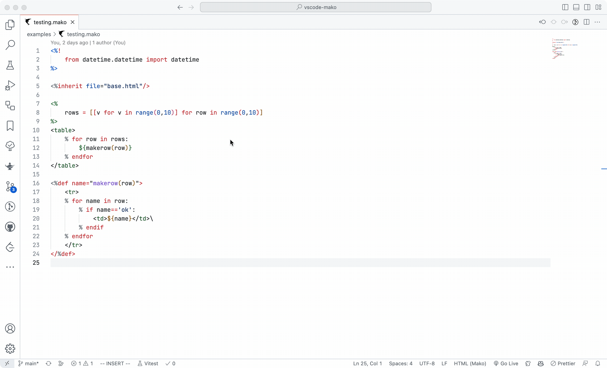

# Vscode plugin for Mako tempalte language

In the historical projects of the company I work for, [Mako](https://github.com/sqlalchemy/mako) was extensively used as a template engine.
However, modern editors do not support features such as highlighting, folding, and snippets for the Mako template engine (Pycharm: https://youtrack.jetbrains.com/issue/PY-51736/Release-legacy-Mako-support-as-a-plugin), making it difficult to make modifications on a massive amount of legacy code without these functionalities. So I decided to write a vscode plugin for Mako.

> This project highly inspired by [jinjahtml-vscode](https://github.com/samuelcolvin/jinjahtml-vscode).



## Features
- highlighting
- Icon
- Folding
- Snippets


## File Associations

You can add more file associations, for example to associate `.html` files with `mako`;
in your user or workspace settings add:

```json
"files.associations": {
  "*.html": "mako"
},
```
